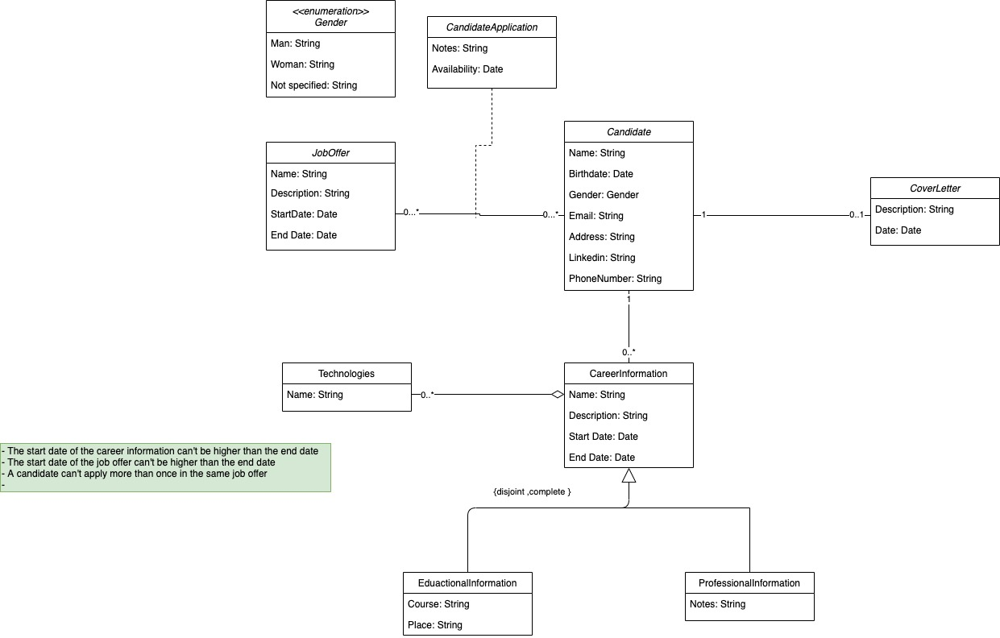
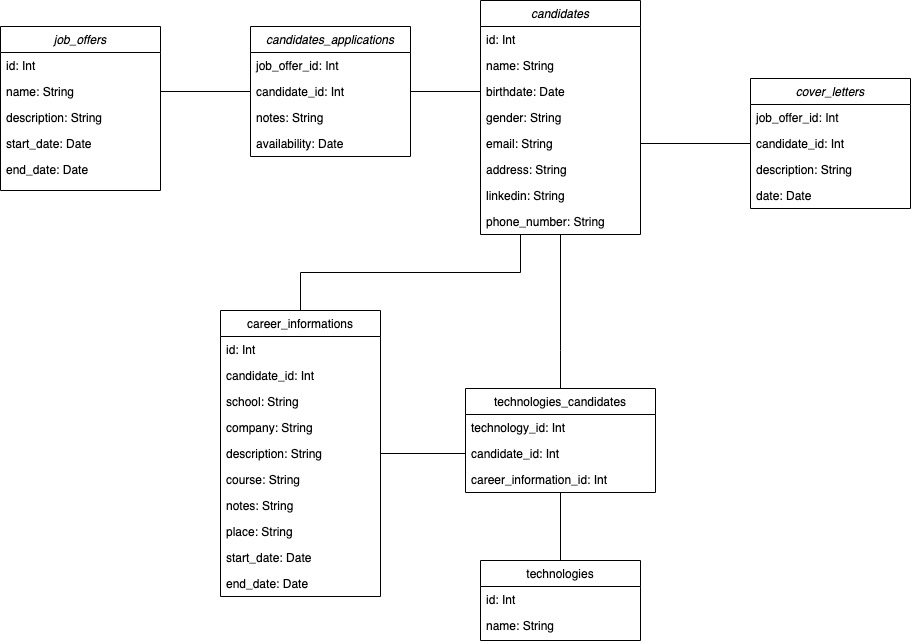

# Job Offers and Candidates Manager

The idea is to create an application (Backend) that stores all the candidates for a specific Job Offer.
Each Job Offer can receive a lot of candidates and each candidate will apply always with a Curriculum Vitae and, optionally, with a Cover Letter.

The Curriculum Vitae will store his/her

- **Personal Identification**:  
    Name  
    Birthdate  
    Gender  
    Address  
    Email  
    Linkedin  
    Phone Number  

- **Educational Information**:  
    School  
    Course  
    Technologies  
    Start Date  
    End Date  

- **Professional Information**:  
    Company  
    Start Date  
    End Date  
    Technologies  
    Notes  

- Education Information and Professional Information can be present in the CV as many times as needed.

**The idea is to:**  

 - calculate the years/months of experience for each Technology present on the Educational and Professional Information

 - list all the candidates that have experience in a specific technology (and the possibility to sort that information per years of experience)
 
 - store some Notes associated to each candidate and his/her availability for that Job Offer
 
 ## UML Diagram
 
 
 ## Relation Diagram
 